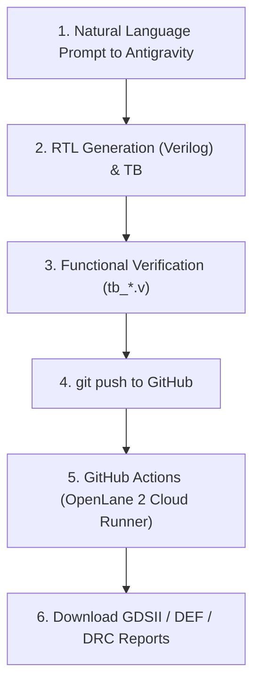

# NLP to GDSII ASIC Design Framework

This repository provides an automated **NLP-to-GDSII** hardware design workflow powered by **Antigravity**, **OpenLane 2 (LibreLane)**, and free **GitHub Actions CI/CD**.

---

## Workflow Overview



## 📖 Guides & Playbooks

- **[Antigravity ASIC Playbook (WORKFLOW_GUIDE.md)](./WORKFLOW_GUIDE.md)**: Full guide with copy-pasteable prompt templates (ALU, UART, SPI, MAC, FIFO), P&R rules of thumb, and local simulation workflows.

---

## Directory Structure

```
.
├── .github/
│   └── workflows/
│       └── openlane.yml       # GitHub Actions workflow for OpenLane 2 hardening
├── designs/
│   └── counter/               # Sample 8-bit counter design
│       ├── config.json        # OpenLane 2 configuration & parameters
│       ├── src/
│       │   ├── counter.v      # Synthesizable Verilog RTL
│       │   └── constraints.sdc# SDC Timing constraints (100MHz clock)
│       └── tb/
│           └── tb_counter.v   # Self-checking testbench
├── scripts/
│   └── run_sim.py             # Local simulation launcher
└── README.md
```

---

## Quick Start: First GDSII Build

### 1. Create a GitHub Repository
1. Go to [GitHub - New Repository](https://github.com/new).
2. Name your repository (e.g. `nlp-to-gdsii-asic`).
3. Leave it Public (unlimited free CI minutes) or Private (2,000 free minutes/month).

### 2. Connect & Push
In your PowerShell terminal in this folder:
```powershell
git init
git add .
git commit -m "Initial commit: OpenLane 2 NLP-to-GDSII framework"
git branch -M main
git remote add origin https://github.com/<YOUR_GITHUB_USERNAME>/<YOUR_REPO_NAME>.git
git push -u origin main
```

### 3. Automatic Hardening & Layout Artifacts
- Once pushed, click on the **Actions** tab in your GitHub repository.
- You will see the **OpenLane 2 ASIC Hardening Flow** running.
- When finished, scroll to **Artifacts** to download:
  - `layout-artifacts-counter`: Contains `counter.gds` (Silicon layout), `counter.def`, and `counter.lef`.
  - `signoff-reports-counter`: Contains Timing slack (STA), Magic DRC, and LVS reports.

---

## Adding New Designs with Antigravity

Just ask Antigravity in plain English:
> *"Antigravity, design an 8-bit ALU with addition, subtraction, AND, OR, XOR operations, and configure it for OpenLane 2 under Sky130 at 50 MHz."*

Antigravity will create:
- `designs/<new_design>/src/<new_design>.v`
- `designs/<new_design>/src/constraints.sdc`
- `designs/<new_design>/tb/tb_<new_design>.v`
- `designs/<new_design>/config.json`

Then simply `git add . && git commit -m "Add new_design" && git push` to produce your next chip layout!

---

## Viewing the Layout

Download and open **[KLayout](https://www.klayout.de/)** (Free & Open Source for Windows) to inspect the generated `.gds` layout file.
